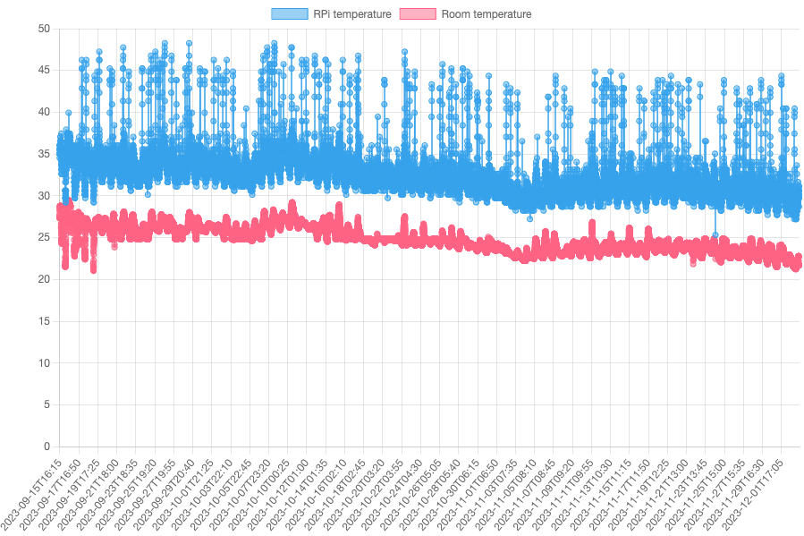

# Raspberry Pi temperature vs room temperature

I have a Raspberry Pi 4 running 24/7, doing various infrequent activities.

It's passively cooled, which means that it's idle temperature is impacted by the ambient room
temperature.

Could it then be possible to create a model where, by measuring the Raspberry Pi temperature,
we can calculate the ambient room temperature?

To build such a model I bought an external USB connected temperature sensor, and started logging
the internal (Raspberry Pi) temperature together with the external (room) temperature, and also load averages.

This project uses [Sigbla](https://sigbla.app) to load and display the internal and external
temperatures in a chart. No model has yet been created, but this is a first step towards that. I'll do a follow-up
later at some point where I also include the load averages and likely some linear regression to build such a model.

I have done a [blog post](https://blog.cfelde.com/2023/12/raspberry-pi-vs-room-temp/) if you're keen, but here's what
the chart looks like:



## How to run

I've included the temperature logs in the `data` folder.

You can build and run using these files like so:

``` sh
./gradlew clean build
java -jar build/libs/raspberry-pi-temperature-1.0-all.jar data/temperature.log data/outside_temp.log
```

When running you can access the chart and temperature table in your browser from the URLs printed to the console.
